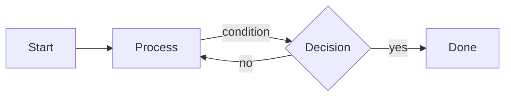

# BanguesesDraw Mermaid Flowchart Flavour Design

Date: 2026-07-01

## Goal

Add a Mermaid flowchart flavour to BanguesesDraw so users can create cheaper, structured AI-generated diagrams while keeping the existing Excalidraw design experience intact.

The first version should support Mermaid flowcharts as their own local design type, then provide a conversion path into Excalidraw for users who want to keep editing visually.

## Context

BanguesesDraw currently stores local Excalidraw scenes as `.excalidraw` files inside project folders under `Designs/`. The app already supports project/design management, Excalidraw editing, local import/export, OpenAI-powered Excalidraw generation, and OpenAI-powered modification of existing Excalidraw scenes.

Direct Excalidraw JSON generation works, but it can be verbose. Mermaid flowchart source is much smaller, easier for AI models to generate reliably, and easier for humans to inspect or edit manually.

## Non-Goals

- Replace Excalidraw as the primary freeform drawing canvas.
- Build a full Mermaid visual canvas editor in the first version.
- Support every Mermaid diagram type in the first version.
- Support complex Mermaid styling, subgraphs, swimlanes, or layout hints in the first version.
- Build perfect graph layout or advanced connector routing in the first version.

## Approaches Considered

### Recommended: Side-by-Side Mermaid Flowchart Flavour

Add Mermaid flowcharts as a second design type beside Excalidraw designs.

Users can create:

- Excalidraw design: freeform drawing, richer visuals, higher AI token usage.
- Mermaid flowchart: structured text diagram, cheaper AI generation, source + preview editing.

This keeps the product easy to understand and avoids compromising the current Excalidraw workflow.

### Alternative: Replace AI Excalidraw Generation With Mermaid

All AI generation would produce Mermaid first, then convert to Excalidraw.

This would reduce token usage, but it would make rich hand-drawn Excalidraw output harder to request. It also forces every AI diagram through a flowchart-shaped model, which is too limiting for open-ended sketches.

### Alternative: Build a Mermaid Canvas Editor First

Create a node-and-edge canvas that writes Mermaid source in the background.

This is attractive long term, but it is a larger product and engineering effort. It duplicates some of Excalidraw's interaction surface and delays the cost-saving feature that prompted this work.

## Selected Experience

The library keeps one project list, but designs can have different types.

Primary actions:

- `New design` creates an Excalidraw design.
- `New Mermaid flowchart` creates a Mermaid flowchart.
- `AI diagram` lets the user choose between Excalidraw and Mermaid output.

The design list should show type clearly with a compact label or icon:

- Excalidraw designs remain editable in the existing editor.
- Mermaid flowcharts open in a Mermaid editor view.

The Mermaid editor view has:

- App header with back, project name, design name, save status, rename, duplicate, export, and delete actions.
- Left source editor for Mermaid text.
- Right rendered preview.
- AI generate/modify action that updates Mermaid source.
- `Convert to Excalidraw` action for supported flowcharts.

The first version should feel utilitarian and close to the existing app: quiet controls, no landing page, no decorative framing.

## Supported Mermaid Scope

The first converter supports only simple flowcharts:



Supported syntax:

- `flowchart LR`
- `flowchart TD`
- Simple node declarations such as `A[Label]`, `A(Label)`, `A{Decision}`, and `A[(Database)]`
- Edges such as `A --> B`
- Labeled edges such as `A -->|label| B`

Unsupported syntax should remain valid as Mermaid source, but `Convert to Excalidraw` should block with a clear message explaining that the converter currently supports simple flowcharts only.

## Storage

Keep storage local and file-based.

Recommended first version:

```text
Designs/
  Project Name/
    Customer journey.excalidraw
    Routing overview.mmd
```

Use `.mmd` for Mermaid source files. This keeps files portable and easy to edit outside BanguesesDraw.

The design list should treat both `.excalidraw` and `.mmd` files as designs. Existing Excalidraw files remain unchanged.

## AI Data Flow

AI Mermaid generation:

1. User opens `AI diagram`.
2. User chooses Mermaid output.
3. The app sends the user prompt plus a compact Mermaid-only system prompt.
4. The model returns Mermaid source only.
5. The app validates that the source begins with a supported `flowchart` declaration.
6. The app saves a new `.mmd` file in the selected project.

AI Mermaid modification:

1. User opens a Mermaid flowchart.
2. User describes the desired change.
3. The app sends current Mermaid source plus the instruction.
4. The model returns full updated Mermaid source only.
5. The app validates the result and replaces the editor source.
6. Autosave or manual save persists the `.mmd` file.

This path should use fewer tokens than direct Excalidraw JSON because the prompt and response are both compact text.

## Conversion Data Flow

Converting Mermaid to Excalidraw:

1. Parse the supported Mermaid flowchart source into a small graph model:
   - Direction.
   - Nodes.
   - Node labels.
   - Node shapes.
   - Edges.
   - Edge labels.
2. Lay out nodes in rows or columns based on `LR` or `TD`.
3. Generate Excalidraw rectangles, diamonds, database-like shapes where practical, text elements, and arrows.
4. Create a new `.excalidraw` design in the same project.
5. Leave the original `.mmd` file unchanged.

Conversion should always create a new Excalidraw design instead of overwriting the Mermaid source.

## Error Handling

- Invalid Mermaid source should show a preview error without blocking text editing.
- Unsupported conversion syntax should show a clear converter error and keep the source unchanged.
- AI output that is empty, not Mermaid, or not a supported flowchart should fail with a retryable message.
- Save failures should mirror the Excalidraw editor: keep the editor open, mark unsaved state, and allow retry.
- Name conflicts during conversion should use the existing duplicate/name conflict behavior.

## Testing

Frontend tests should cover:

- Listing `.mmd` files beside `.excalidraw` files.
- Creating a Mermaid flowchart.
- Opening a Mermaid flowchart in the Mermaid editor.
- Editing source and saving.
- Preview error state for invalid Mermaid.
- AI Mermaid generation request and success flow with mocked `fetch`.
- AI Mermaid modification request and success flow with mocked `fetch`.
- Convert button success path for simple flowcharts.
- Convert button error path for unsupported syntax.

Parser/converter tests should cover:

- `flowchart LR` and `flowchart TD`.
- Rectangle, rounded, decision, and database node shapes.
- Unlabeled and labeled edges.
- Basic branching graphs.
- Unsupported syntax detection.
- Generated Excalidraw scene validation.

Backend tests should cover:

- Listing mixed `.excalidraw` and `.mmd` design files.
- Reading and writing `.mmd` files.
- Rename, duplicate, delete, import, and export behavior for `.mmd` files.

## Phased Implementation

### Phase 1: Local Mermaid Files

- Extend design metadata with a type field.
- List `.mmd` files in projects.
- Create, rename, duplicate, delete, import, and export Mermaid files.
- Add Mermaid editor with source editing, preview, save, and autosave.

### Phase 2: AI Mermaid Generation

- Add Mermaid output mode to the AI diagram dialog.
- Add Mermaid modification in the Mermaid editor.
- Reuse the existing AI settings dialog and model selection.
- Add validation and friendly errors for bad AI output.

### Phase 3: Mermaid to Excalidraw Conversion

- Implement the simple flowchart parser.
- Implement basic graph layout.
- Generate valid Excalidraw scene JSON.
- Add `Convert to Excalidraw` action.

## Open Decisions

- Whether `AI diagram` should default to Excalidraw or Mermaid. Recommended default: remember the user's last choice.
- Whether Mermaid rendering should use the `mermaid` npm package or a lighter parser/renderer path. Recommended: use the official `mermaid` package for preview, and a small local parser for the limited conversion subset.
- Whether converted Excalidraw designs should auto-open after creation. Recommended: yes, because conversion is usually a handoff into visual editing.
